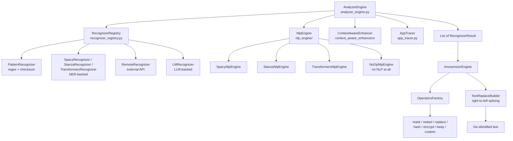

# How the Full Presidio Architecture Works

Reference document for the independent study. Everything here was read
directly from the source at `github.com/microsoft/presidio` (`main` branch),
not from memory — file paths are given so any claim can be checked.

---

## 1. The big picture: two independent stages

Presidio's core design decision is that **finding PII** and **hiding PII** are
completely separate systems that share nothing but a data structure.

```
                    ┌─────────────────┐
   text ──────────► │ AnalyzerEngine  │ ──► List[RecognizerResult]
                    │   (detection)   │      (entity_type, start, end, score)
                    └─────────────────┘              │
                                                     ▼
                    ┌──────────────────┐     ┌───────────────────┐
   de-identified ◄──│ AnonymizerEngine │ ◄───│  same list + the  │
   text             │ (transformation) │     │  original text    │
                    └──────────────────┘     └───────────────────┘
```

The Analyzer never modifies text — it only reports *"characters 45 to 67 are
an EMAIL_ADDRESS, confidence 1.0."* The Anonymizer never searches for
anything — it only applies transformations at positions it was handed.

**Why this matters:** you can swap detection (regex → NER → LLM) without
touching anonymization, and vice versa. It is also why our regex-only build
was possible at all — we replaced the entire detection stage and the
anonymization stage kept working unchanged.

---

## 2. Component map



---

## 3. The Analyzer, component by component

### 3.1 `AnalyzerEngine` — the orchestrator
**File:** `presidio-analyzer/presidio_analyzer/analyzer_engine.py` (510 lines)

Holds three collaborators and coordinates them. It contains **no detection
logic of its own** — it is pure orchestration, scoring policy, and filtering.

### 3.2 `NlpEngine` — the linguistic layer
**Files:** `presidio_analyzer/nlp_engine/`

Runs *once* per text, before any recognizer. Produces an `NlpArtifacts`
object containing:

| Field | What it is | Who uses it |
|---|---|---|
| `tokens` | the spaCy `Doc` (word segmentation) | context enhancer |
| `lemmas` | base forms ("called" → "call") | context enhancer |
| `entities` | **NER model output** (PERSON, ORG, GPE, DATE…) | `SpacyRecognizer` |
| `scores` | confidence per NER entity | `SpacyRecognizer` |
| `keywords` | lemmas minus stopwords/punctuation | context enhancer |

Four implementations ship with Presidio:

| Engine | Backing | Notes |
|---|---|---|
| `SpacyNlpEngine` | spaCy | default; `en_core_web_lg` (~560 MB) |
| `StanzaNlpEngine` | Stanza | wider language coverage, slower |
| `TransformersNlpEngine` | HuggingFace | highest accuracy, heaviest |
| `NoOpNlpEngine` | nothing | returns empty artifacts — for regex-only setups |

**Critical constraint (verified in `customizing_nlp_models` docs):** only
**one NER model per language** can run as the `NlpEngine`. A second model must
be wrapped as a separate recognizer instead.

### 3.3 `RecognizerRegistry` — the recognizer collection
**File:** `presidio_analyzer/recognizer_registry/recognizer_registry.py` (422 lines)

Holds every active `EntityRecognizer`. Its main job is
`get_recognizers(language, entities, all_fields, ad_hoc_recognizers)` —
returning only the recognizers relevant to *this* request. Recognizers are
filtered by supported language and supported entity type.

Supporting files:
- `recognizer_registry_provider.py` (248 lines) — builds a registry from YAML
- `recognizers_loader_utils.py` (833 lines) — YAML → recognizer instantiation
- `input_validation/yaml_recognizer_models.py` (659 lines) — pydantic schemas

That's ~1,700 lines purely for **configuration loading**, not detection.

### 3.4 The recognizer hierarchy
**Files:** `entity_recognizer.py`, `local_recognizer.py`, `pattern_recognizer.py`

```
EntityRecognizer  (abstract: analyze(), load(), enhance_using_context())
├── LocalRecognizer  (runs in-process)
│   ├── PatternRecognizer      ← regex + optional checksum  [we vendored this]
│   │   ├── CreditCardRecognizer, IbanRecognizer, ... (10 generic)
│   │   └── UsSsnRecognizer, UkNhsRecognizer, ... (~77 country-specific)
│   ├── SpacyRecognizer        ← reads NER results out of NlpArtifacts
│   ├── StanzaRecognizer
│   ├── TransformersRecognizer
│   ├── GLiNERRecognizer, HuggingFaceNerRecognizer, MedicalNERRecognizer
│   └── PhoneRecognizer        ← python-phonenumbers (not regex, not ML)
├── RemoteRecognizer  (calls an external service)
│   └── AzureAILanguageRecognizer, AzureHealthDeidRecognizer
└── LMRecognizer  (LLM-backed)
    └── LangExtractRecognizer, AzureOpenAILangExtractRecognizer
```

**The key insight:** `SpacyRecognizer` does *not* run a model. The NLP engine
already ran it; `SpacyRecognizer` just reads `nlp_artifacts.entities` and
converts them into `RecognizerResult` objects. That is how NER output enters
the same pipeline as regex output — everything becomes a `RecognizerResult`.

### 3.5 `ContextAwareEnhancer` — the part that makes weak patterns usable
**Files:** `presidio_analyzer/context_aware_enhancers/lemma_context_aware_enhancer.py` (370 lines)

This is the component our regex-only build **could not** implement, and it is
architecturally important.

Many recognizers have deliberately weak patterns. Example from
`us_ssn_recognizer.py`:

```python
Pattern("SSN4 (very weak)", r"\b[0-9]{9}\b", 0.05)   # ANY nine digits
```

Scored 0.05, this is useless alone — it matches order numbers, part numbers,
anything. The enhancer rescues it: each recognizer declares context words
(`"ssn"`, `"social"`, `"security"`), and if those **lemmas** appear near the
match in the text, the score is boosted (default to ~0.4).

```
"Employee ID 123456789"        → 0.05, discarded
"His SSN is 123456789"         → 0.05 boosted to 0.4, kept
```

**Consequence:** the enhancer needs `nlp_artifacts.lemmas`, which only an NLP
engine produces. So **weak regex recognizers structurally depend on the NLP
layer.** "Pure regex" only works for patterns strong enough to stand alone —
which in practice means the checksum-backed ones.

---

## 4. The exact `analyze()` flow

Verified by reading `analyzer_engine.py`:

```
1. registry.get_recognizers(language, entities, ad_hoc_recognizers)
       → select the applicable recognizers for this request

2. if entities is None → expand to every supported entity

3. nlp_artifacts = nlp_engine.process_text(text, language)
       → ONE NLP pass: tokens, lemmas, NER entities, scores

4. for each recognizer:
       lazy load() if needed
       results += recognizer.analyze(text, entities, nlp_artifacts)
       → regex recognizers ignore nlp_artifacts
       → NER recognizers read entities out of it

5. results = _enhance_using_context(text, results, nlp_artifacts,
                                    recognizers, context)
       → boost scores where context words appear nearby

6. results = __remove_low_scores(results, score_threshold, recognizers)
       → per-entity threshold, then recognizer default, then engine default

7. results = EntityRecognizer.remove_duplicates(results)
       → drop contained/duplicate spans of the same entity type

8. results = _remove_allow_list(...)      # optional whitelist
9. results = __remove_decision_process(...)  # strip trace unless requested

10. return List[RecognizerResult]
```

Step 3 is the expensive one — a single NLP pass shared by every recognizer.
Steps 5–7 are the scoring policy that turns raw matches into final answers.

---

## 5. The Anonymizer

**Files:** `presidio-anonymizer/presidio_anonymizer/`

| Component | File | Role |
|---|---|---|
| `AnonymizerEngine` | `anonymizer_engine.py` | orchestration |
| `EngineBase` | `core/engine_base.py` | shared operate loop |
| `OperatorsFactory` | `operators/operators_factory.py` | name → operator class |
| `TextReplaceBuilder` | `core/text_replace_builder.py` | safe text splicing |
| Operators | `operators/*.py` | the transformations |

**Operators available:**

| Operator | Reversible? | What it does |
|---|---|---|
| `replace` | no | swap for `<ENTITY_TYPE>` or custom text |
| `redact` | no | delete entirely |
| `mask` | no | overwrite N chars with a character |
| `hash` | no | SHA-256/512 with salt |
| `encrypt` | **yes** (AES) | reversible via `DeanonymizeEngine` |
| `keep` | n/a | leave untouched |
| `custom` | depends | user-supplied lambda |

**The splicing detail:** replacements are applied **right-to-left** (highest
start position first). Left-to-right would shift the character offsets of
every span not yet processed, and the positions would drift.

`DeanonymizeEngine` + the `decrypt` operator reverse AES-encrypted entities —
the reason `encrypt` exists as a separate operator type (`OperatorType.Deanonymize`).

---

## 6. The configuration layer

Presidio can be driven entirely from YAML instead of Python:

| File | Purpose |
|---|---|
| `conf/default.yaml` | full default configuration |
| `conf/default_recognizers.yaml` | which recognizers to load |
| `conf/spacy.yaml` | spaCy engine + model mapping |
| `conf/transformers.yaml` | HuggingFace engine config |
| `conf/no_op.yaml` | the no-NLP configuration |
| `conf/slim.yaml` | reduced recognizer set |

`AnalyzerEngineProvider`, `NlpEngineProvider` and `RecognizerRegistryProvider`
read these and construct the objects. This layer is optional — everything can
be instantiated directly in Python.

---

## 7. Where our current build sits

| Layer | Full Presidio | Our regex-only build |
|---|---|---|
| `AnalyzerEngine` | ✔ 510 lines | ✘ replaced by our 150-line `regex_engine.py` |
| `NlpEngine` | ✔ 4 implementations | ✘ none |
| NER recognizers | ✔ Spacy/Stanza/Transformers/GLiNER | ✘ none |
| `ContextAwareEnhancer` | ✔ | ✘ none |
| `RecognizerRegistry` | ✔ + YAML providers | ✘ plain Python list |
| `PatternRecognizer` | ✔ | ✔ vendored unmodified |
| Generic recognizers | 10 | ✔ all 10 |
| Country recognizers | ~77 | ✘ none |
| Anonymizer operators | 7 | ✔ 4 (mask/redact/replace/hash) |
| Deanonymize / encrypt | ✔ | ✘ |

**Measured consequence** (from `evaluate.py` on 1,500 records): we reach 431
of 2,863 labeled PII spans — 15%. The missing 85% (`PERSON`,
`STREET_ADDRESS`, `GPE`, `ORGANIZATION`, `TITLE`, `AGE`, `NRP`) all require
the NER layer.

---

## 8. Dependency cost of the full architecture

From `presidio-analyzer/pyproject.toml`:

```
spacy, numpy, click, regex, tldextract, pyyaml, phonenumbers, pydantic
```

| | Our build now | Full architecture |
|---|---|---|
| pip packages | 3 | 8 + a spaCy model |
| Model weights | **0 bytes** | 13 MB (`sm`) – 560 MB (`lg`) |
| Import needs an ML lib? | no | yes (spaCy is unguarded) |

Stanza and Transformers engines are **optional** — their imports are wrapped
in `try/except ImportError` with an `is_available` flag, so they can be
vendored without installing those libraries. spaCy cannot: `import spacy` is
unguarded in `spacy_nlp_engine.py`, `transformers_nlp_engine.py`, and even in
`no_op_nlp_engine.py` (which builds an empty spaCy `Doc`).

---

## 9. The architectural conclusion

Presidio is best understood as **three detection tiers feeding one scoring
pipeline**:

| Tier | Mechanism | Precision | Needs a model? |
|---|---|---|---|
| Checksum-backed patterns | regex + arithmetic validation | ~1.00 (measured) | no |
| Weak patterns + context | regex + lemma proximity | medium | **yes** (lemmas) |
| NER | statistical model | model-dependent | yes |

Everything converges on `RecognizerResult`, gets scored and deduplicated by
one shared policy, and is handed to an anonymizer that knows nothing about
how any of it was found. That uniform interface is the actual architecture —
the recognizers are just plugins into it.
