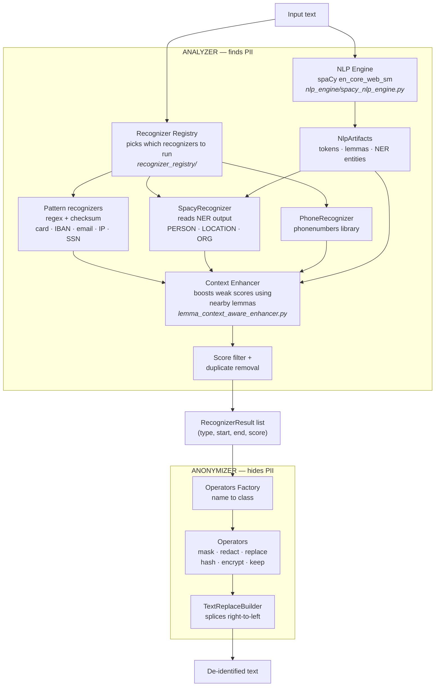

# PII Detection and De-identification System

Independent study. Built on Microsoft Presidio.

---

## 1. The problem

Text written by people constantly contains information that identifies them:
names, phone numbers, addresses, account numbers, dates of birth. Before that
text can be stored, logged, shared with a vendor, or used to train a model, the
identifying parts have to be found and removed.

Two things have to happen, and they are separate problems:

1. **Find** the identifying information (which characters in the text are PII).
2. **Hide** it (mask it, delete it, replace it, or encrypt it).

This system does both. It is built from Microsoft Presidio, an open-source
framework for exactly this task. Rather than installing Presidio as a package,
individual source files were copied from its GitHub repository so that every
component could be read and understood. 187 files were copied without
modification; the full list and the source URL for each is in
`VENDORED_FILES.md`.

---

## 2. Design: two independent stages

The central design decision in Presidio is that finding and hiding are
completely separate systems. They share one data structure and nothing else.

```
                  ┌──────────────────┐
  raw text ─────► │  ANALYZER        │ ─────► list of findings
                  │  (detection)     │        each one is:
                  └──────────────────┘        (entity type, start, end, score)
                                                        │
                                                        ▼
                  ┌──────────────────┐        ┌──────────────────┐
  clean text ◄─── │  ANONYMIZER      │ ◄───── │ findings +       │
                  │  (transformation)│        │ original text    │
                  └──────────────────┘        └──────────────────┘
```

The analyzer never edits text. It only reports "characters 86 to 107 are an
email address, confidence 1.00". The anonymizer never searches for anything. It
only applies a transformation at positions it was handed.

The practical benefit is that either half can be replaced without touching the
other. This project did exactly that: an earlier version used only regular
expressions for detection, and when the detection stage was replaced entirely,
the anonymization stage kept working without a single change.

---

## 3. Full architecture



---

## 4. What each component does

| Component | Job | File |
|---|---|---|
| **AnalyzerEngine** | Runs the whole detection sequence. Contains no detection logic of its own. | `presidio_analyzer/analyzer_engine.py` |
| **NLP Engine** | Reads the sentence once. Produces tokens, lemmas, and named entities. This is the only machine-learning component. | `presidio_analyzer/nlp_engine/spacy_nlp_engine.py` |
| **Recognizer Registry** | Decides which recognizers apply to this request. 97 are available; 17 load for English + US. | `presidio_analyzer/recognizer_registry/` |
| **Pattern recognizers** | Regular expression plus a validity check. Credit card runs the Luhn checksum, IBAN runs mod-97. | `presidio_analyzer/predefined_recognizers/generic/` |
| **SpacyRecognizer** | Does not run a model. Reads the entities the NLP engine already produced and converts them to the common result format. | `predefined_recognizers/nlp_engine_recognizers/spacy_recognizer.py` |
| **Context Enhancer** | Raises the confidence of a weak match when a supporting word appears nearby. | `presidio_analyzer/context_aware_enhancers/` |
| **AnonymizerEngine** | Applies the chosen transformation to each detected span. | `presidio_anonymizer/anonymizer_engine.py` |
| **Operators** | The transformations: mask, redact, replace, hash, encrypt, decrypt, keep. | `presidio_anonymizer/operators/` |
| **TextReplaceBuilder** | Edits the string. Works right-to-left so earlier positions stay valid. | `presidio_anonymizer/core/text_replace_builder.py` |

### Three kinds of detection

Everything in the system reduces to one of three detection strategies. They
behave very differently, and most of the results in section 7 follow from this
distinction.

| Strategy | How it decides | Example |
|---|---|---|
| Regex + checksum | Pattern match, then arithmetic proof | Credit card: matches 16 digits, then Luhn checksum must pass |
| Regex + context | Weak pattern, rescued by nearby words | SSN: any 9 digits scores 0.05, rises only if "SSN" appears near it |
| Machine learning | Statistical model trained on text | PERSON, LOCATION, ORGANIZATION from spaCy |

---

## 5. Worked example

The following is actual program output from `python trace_example.py`.

**Input:**
```
Dr. Sarah Johnson from Boston General Hospital called on March 15, 2024.
Her email is sarah.johnson@bgh.org, phone +1 415-555-2671,
SSN 457-55-5462, card 4111 1111 1111 1111.
```

### Stage 1: the NLP engine reads the sentence

It runs once and produces three things.

```
tokens : ['Dr.', 'Sarah', 'Johnson', 'from', 'Boston', 'General', 'Hospital', 'called', 'on', 'March', ...]
lemmas : ['Dr.', 'Sarah', 'Johnson', 'from', 'Boston', 'General', 'Hospital', 'call',   'on', 'March', ...]
                                                                               ^^^^^^
                                                              "called" reduced to its base form

named entities:
    PERSON      'Sarah Johnson'
    DATE_TIME   'March 15, 2024'
    DATE_TIME   '1111 1111'        <- wrong, these are credit card digits
```

Lemmas matter because the context enhancer in stage 3 matches against base word
forms rather than exact spellings.

### Stage 2 and 3: recognizers run, then scores are adjusted

```
ENTITY          SPAN        SCORE   FOUND BY                TEXT
------------------------------------------------------------------------------
PERSON          4:17        0.85    SpacyRecognizer         'Sarah Johnson'
DATE_TIME       57:71       0.85    SpacyRecognizer         'March 15, 2024'
EMAIL_ADDRESS   86:107      1.00    EmailRecognizer         'sarah.johnson@bgh.org'
URL             86:94       0.50    UrlRecognizer           'sarah.jo'
URL             100:107     0.50    UrlRecognizer           'bgh.org'
PHONE_NUMBER    115:130     0.75    PhoneRecognizer         '+1 415-555-2671'
US_SSN          136:147     0.85    UsSsnRecognizer         '457-55-5462'
CREDIT_CARD     154:173     1.00    CreditCardRecognizer    '4111 1111 1111 1111'
DATE_TIME       164:173     0.85    SpacyRecognizer         '1111 1111'
```

Four things are worth reading closely here.

**The SSN scored 0.85, not 0.50.** The SSN pattern by itself is worth 0.50. The
context enhancer saw the lemma "ssn" three characters earlier and raised the
score. Without the NLP engine there would be no lemmas, and this boost could not
happen.

**The phone number scored 0.75, not 0.40.** Same mechanism. The word "phone"
appears immediately before it.

**The email address scored 1.00 with no help.** Its recognizer validated the
domain directly. Checksum-backed and format-validated recognizers do not need
context.

**Two mistakes are visible.** `UrlRecognizer` matched fragments inside the email
address, and spaCy labelled part of the credit card number as a date. Both are
handled downstream: overlapping detections are resolved by keeping the
higher-scoring one.

### Stage 4: the anonymizer replaces each span

A different transformation was chosen per entity type:

```
PERSON          replace   -> <NAME>
DATE_TIME       replace   -> <DATE>
EMAIL_ADDRESS   hash      -> irreversible SHA-256
PHONE_NUMBER    redact    -> deleted entirely
CREDIT_CARD     mask      -> first 15 characters overwritten
US_SSN          replace   -> <SSN>
```

**Output:**
```
Dr. <NAME> from Boston General Hospital called on <DATE>. Her email is
b3d9e2e3184dafaa4ee0e0a0d59e7ef88aa15c858e935cb7ca2b9f3ceccdc4c0, phone ,
SSN <SSN>, card ***************1111.
```

Note what did **not** get removed: "Boston General Hospital". That is a real
failure and it is explained in section 7.

---

## 6. Test data

Testing uses Microsoft's own evaluation dataset, not data written for this
project. The file is `data/synth_dataset_v2.json`, downloaded from
`github.com/microsoft/presidio-research`. It is the dataset the Presidio team
use to measure their own recognizers.

- 1,500 records
- 2,863 labelled PII spans
- Each record carries the correct answer: which character range is which entity

Because the correct answers were written by Microsoft rather than by us, the
scores below cannot be tuned in our favour.

---

## 7. Results

Two systems were measured on the same 1,500 records with the same scoring code:
the earlier regex-only version, and the current full architecture.

### Overall

| | Regex only | Full architecture |
|---|---:|---:|
| PII spans found | 327 | **1,276** |
| Recall | 0.12 | **0.48** |
| Precision | **0.83** | 0.52 |

Detection nearly quadrupled. Precision fell by about a third. That trade is the
central result.

### Whole documents successfully cleaned

A document is only safe if *every* piece of PII in it was removed. One missed
name still identifies the person.

| | Regex only | Full architecture |
|---|---:|---:|
| Fully de-identified | 209 (14%) | **539 (36%)** |
| Partly cleaned, something leaked | 78 | 394 |
| Nothing detected at all | 1,100 | 454 |

### What works well

| Entity | Recall | Precision | Why |
|---|---:|---:|---|
| EMAIL_ADDRESS | 1.00 | 1.00 | Fixed format, validated |
| IP_ADDRESS | 1.00 | 1.00 | Fixed format, validated |
| IBAN_CODE | 1.00 | 1.00 | mod-97 checksum |
| US_SSN | 1.00 | 1.00 | Pattern plus context boost |
| DATE_TIME | 1.00 | — | The model catches written-out dates |
| CREDIT_CARD | 0.77 | 1.00 | Luhn checksum |

Every entity holding precision 1.00 is one where a mathematical check confirms
the match. A random string almost never passes a checksum by accident.

### What does not work

| Entity | Recall | Precision | Reason |
|---|---:|---:|---|
| STREET_ADDRESS | 0.14 | — | spaCy has no address entity. It was never trained to recognise one. |
| ORGANIZATION | 0.00 | — | Presidio disables this by default (see below) |
| GPE (cities) | 0.45 | 0.80 | Small model misses many place names |
| PERSON | 0.64 | 0.70 | Small model; misses unusual names |
| DATE_TIME | — | **0.16** | spaCy tags ZIP codes, house numbers, "79 year old", "next week" as dates |
| US_DRIVER_LICENSE | 0.80 | **0.03** | Its pattern matches any 6 to 14 digit number |

The two precision failures have the same underlying cause in different forms.
The `US_DRIVER_LICENSE` pattern is literally `\b([0-9]{6,14})\b` scored at 0.01.
It is *designed* to be useless on its own and to depend on the context enhancer
rescuing it. When the supporting words are absent it fires on every number in
sight.

### The ORGANIZATION experiment

Presidio's configuration file disables ORGANIZATION detection with the comment
"Has many false positives". Rather than take that on trust, both settings were
measured:

| Setting | Recall | Precision |
|---|---:|---:|
| Disabled (Presidio default) | 0.48 | 0.50 |
| Enabled | 0.53 | 0.45 |

Enabling it finds 123 more organisations but produces 418 false ones. The
default is justified. This is why "Boston General Hospital" survived in the
worked example.

### Not detectable by any recognizer

203 labelled spans have no corresponding recognizer in Presidio at all:
TITLE (92), AGE (74), ZIP_CODE (37). These are not failures of the model. No
component exists that claims to find them. All three could be added with simple
pattern recognizers.

---

## 8. Where the results are

| File | What is in it |
|---|---|
| `results/architecture_comparison.json` | The regex-only vs full comparison. Both systems, per-entity recall and precision, machine readable. |
| `results/full_architecture_metrics.json` | Full architecture scored on all 1,500 records, default settings. |
| `results/full_architecture_metrics_org.json` | Same, with ORGANIZATION detection enabled. Used for the experiment above. |
| `results/FULL_TEST_REPORT.txt` | 512 KB, human readable. Every test record printed in full: input text, correct answer, what the system produced, and whether each span was found. Also lists each failure with a diagnosed cause. |
| `results/report_data.json` | Per-entity worked examples with input, detections, and anonymized output. |
| `data/synth_dataset_v2.json` | The test data itself, with Microsoft's ground-truth labels. |

### Commands that produce them

```
python trace_example.py          one sentence, every stage shown
python compare_architectures.py  the headline comparison
python evaluate_full.py          full architecture, detailed scoring
python evaluate_full.py --org    the ORGANIZATION experiment
python test_cases.py             29 unit tests, pass/fail
```

### Supporting documents

| File | Contents |
|---|---|
| `RESULTS.md` | Every number, with caveats |
| `VENDORED_FILES.md` | Which files came from Microsoft and which were written here |
| `ARCHITECTURE.md` | Presidio's internal design, read from its source |
| `IMPLEMENTATION_PLAN.md` | What was built, and what remains |

---

## 9. Limitations

**The smallest model was used.** `en_core_web_sm` is 13 MB. Presidio's own
default is `en_core_web_lg` at roughly 400 MB, and a transformer version exists
above that. The PERSON and LOCATION numbers are therefore a floor, not a
ceiling. This was a deliberate choice so that each later upgrade can be measured
against a known baseline.

**No transformer model was used.** `transformers` and `torch` are not installed.
The NER model here uses spaCy's older convolutional architecture.

**Nothing was trained.** No model was fitted during this project. The spaCy model
was downloaded pre-trained, and it was trained on news and web text, not on PII
or medical records. That mismatch explains the street address result directly:
the training data had no such category.

**Overlap-based scoring.** A detection counts as correct if it overlaps the
correct answer. Requiring exact boundaries would produce lower numbers.

**Synthetic test data.** The records are generated from templates. Real prose
would likely be harder.

---

## 10. Next steps

Ordered by expected benefit against effort.

1. Move to `en_core_web_lg`. One command. Directly targets the 1,045 spans
   missed across PERSON, GPE and STREET_ADDRESS.
2. Add three pattern recognizers for ZIP_CODE, AGE and TITLE. Recovers the 203
   currently unreachable spans.
3. Reconsider the score threshold. For de-identification a miss is a privacy
   breach while an over-redaction is a minor inconvenience. The current settings
   treat both as equally bad, which is the wrong trade for this task.
4. Replace the general-purpose NER model with one trained on PII. Models trained
   for de-identification have address and identifier categories that
   `en_core_web_sm` lacks.
5. Evaluate on the i2b2 clinical corpus once the data use agreement is approved.
